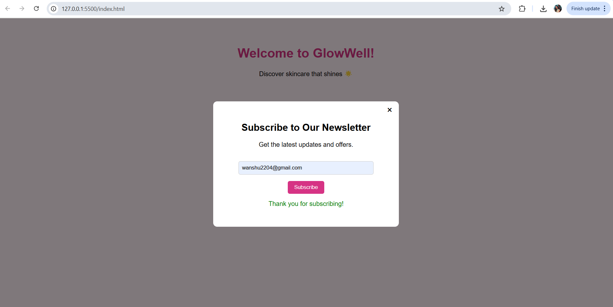

# 📬 Newsletter Signup Popup – GlowWell

This project creates a stylish, responsive popup form that appears when users visit the page. It prompts them to subscribe to a newsletter with built-in email validation.

---

## ✨ Features

- Animated newsletter popup  
- Responsive design  
- Input email validation with instant feedback  
- Closes with "X" or submission  
- Built using **HTML**, **CSS**, and **JavaScript**

---

## 🚀 How to Use

1. Open `index.html` in your browser.  
2. After 1 second, a popup will appear.  
3. Enter a valid email address and click **Subscribe**.  
4. You will get instant feedback based on the validity of the input.

---

## 📁 Technologies Used

- HTML  
- CSS  
- JavaScript

---

## 📌 Folder Structure

newsletter-popup/
├── index.html
├── style.css
├── script.js
└── screenshot.png
---

## 📫 Contact

Created by **Wanshita Singh**  
> For internship project submission
